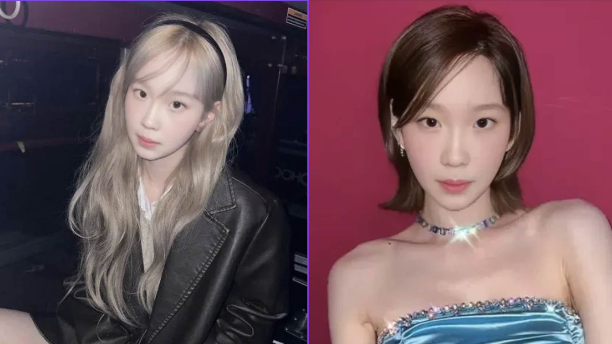
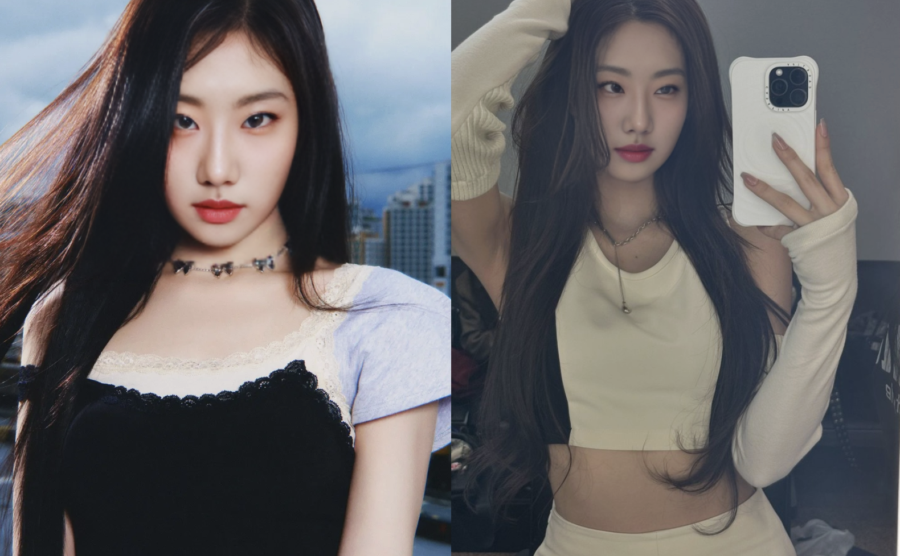
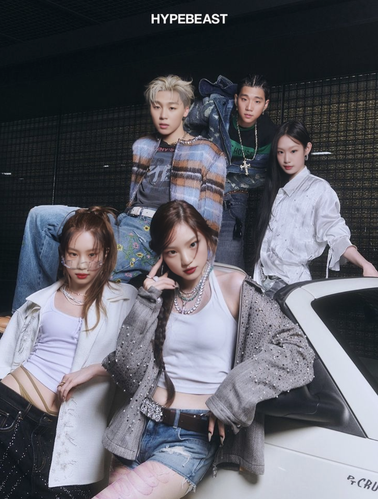

# Idolization: A Generative Model for Identity-Preserving K-Pop Style Transfer
**Authors:** You Joo Lee, Jueun Jung, Keunil Lee, Heejung Uh

**Affiliation:** Yonsei University Data Science Lab (DSL)

### “What if I were an idol?”
This project explores that question through a **Generative AI-based style transfer pipeline** that transforms a given face into an *idolized version* while preserving its original identity.

By combining **LoRA fine-tuning, IP-Adapter, ReActor FaceSwap, and RealESRGAN + CodeFormer**, we created a pipeline capable of generating SM, YG, and JYP-style portraits from real facial inputs — keeping the person’s identity intact while adding the aesthetic tone of each entertainment agency.

## Project Overview

| Item | Description |
|------|--------------|
| **Title** | Idolization — Face-to-Idol Generative Model |
| **Team** | DSL Modeling: Generative Model Team (Yonsei University) |
| **Objective** | Generate idol-style portraits from input faces while preserving identity fidelity |
| **Core Components** | LoRA Fine-Tuning · IP-Adapter FaceID Plus v2 · ReActor FaceSwap · RealESRGAN + CodeFormer |

## Pipeline Overview

### 1️⃣ LoRA Fine-Tuning

- Curated **20–25 high-quality frontal images** for each entertainment agency (SM, YG, JYP).
- Fine-tuned **Stable Diffusion v1.5** to capture each agency’s distinct tone, lighting, and visual aesthetic.
- Produced `.safetensors` weights that encode stylistic priors for each label.

📁 **Included Files**
- `Dataset_Maker.ipynb`
- `trained_lora_weights/`
  - `sm_woman.safetensors`, `yg_woman.safetensors`, `jyp_woman.safetensors`
  - `sm_man.safetensors`, `yg_man.safetensors`, `jyp_man.safetensors`

> LoRA served as the “agency training” phase — learning each label’s signature visual identity (e.g., SM’s ethereal tone, YG’s edgy contrast, JYP’s colorful brightness).


### 2️⃣ IP-Adapter (FaceID Plus v2)

- Injected **facial embeddings** into the diffusion process for **identity preservation**.
- Ensured that individual facial features remain consistent after style transfer.
- The FaceID Plus v2 version of IP-Adapter is optimized for **identity retention**,  
  working robustly alongside LoRA and text-based prompts.
- Implemented using **ComfyUI** with `ipadapter_faceid_plusv2.json`.

📁 **Included File**
- `workflows/ipadapter_faceid_plusv2.json`

> Conceptually, IP-Adapter acts as a *facial anchor*, preserving input identity while LoRA applies stylistic conditioning.


### 3️⃣ ReActor FaceSwap + RealESRGAN + CodeFormer

- Utilized **ArcFace-based embeddings** (via InsightFace) to seamlessly swap generated faces into real idol photographs.
- **ReActor** performs fine-grained **facial alignment, tone correction, and boundary blending**,  
  producing natural and photorealistic composites.
- **RealESRGAN** enhances texture fidelity and upscales image resolution.  
- **CodeFormer** restores facial details and removes noise artifacts.  
- The combined workflow yields **high-resolution, cohesive, and realistic results**.

📁 **Included File**
- `workflows/reactor_faceswap.json`

> This stage represents the “debut” — merging the stylized AI-generated identity into real idol imagery.

## Environment Setup

- **Base Model:** RealisticVision v5.1 (Stable Diffusion 1.5 derivative)  
- **Frameworks:** PyTorch · Diffusers · ComfyUI  
- **Training Platforms:** Google Colab · Vessl Workspace  
- **Additional Tools:** InsightFace (ArcFace), RealESRGAN, CodeFormer  


## Final Outputs

| SM Woman Style | YG Woman Style | JYP Woman Style |
|:--:|:--:|:--:|
|  |  |  |

| YG Woman Style | Team Photo |
|:--:|:--:|
| |  |

> Each image was generated through the final workflow: **LoRA (style) + IP-Adapter (identity) + ReActor (face swap) + RealESRGAN/CodeFormer (refinement)**.


---

## Repository Structure
```markdown
Idolization_Project
├── Dataset_Maker.ipynb
├── trained_lora_weights/
│ ├── sm_woman.safetensors
│ ├── yg_woman.safetensors
│ ├── jyp_woman.safetensors
│ ├── sm_man.safetensors
│ ├── yg_man.safetensors
│ └── jyp_man.safetensors
├── workflows/
│ ├── ipadapter_faceid_plusv2.json
│ └── reactor_faceswap.json
└── results/
├── sm_output.png
├── yg_woman_output.png
├── yg_man_output.png
├── jyp_output.png
└── team_output.png
```
## Disclaimer

This project was conducted **solely for academic and non-commercial purposes** under the Yonsei University Data Science Lab (DSL). All celebrity photographs were used **strictly as visual references**. All copyrights and likeness rights remain with their respective owners. The generated outputs are for **educational presentation use only** and are **not intended for commercial distribution**.

## References

### Dataset & Training Resources

- **Dataset Maker by Hollowstrawberry** — based on works by [Kohya-ss](https://github.com/kohya-ss/sd-scripts) and [Linaqruf](https://colab.research.google.com/github/Linaqruf/kohya-trainer/blob/main/kohya-LoRA-dreambooth.ipynb)

### Base & Pretrained Models

- **RealisticVision v5.1** — [moiu2998/realisticVisionV60B1_v51VAE.safetensors](https://huggingface.co/moiu2998/mymo/blob/3c3093fa083909be34a10714c93874ce5c9dabc4/realisticVisionV60B1_v51VAE.safetensors)
- **Stable Diffusion VAE (Fine-tuned)** — [stabilityai/sd-vae-ft-mse-original](https://huggingface.co/stabilityai/sd-vae-ft-mse-original/blob/main/vae-ft-mse-840000-ema-pruned.safetensors)
- **IP-Adapter FaceID Plus v2** — [h94/IP-Adapter](https://huggingface.co/h94/IP-Adapter/blob/main/models/ip-adapter-plus-face_sd15.safetensors)
- **CLIP Vision Model** — Used internally for image embedding extraction and conditioning alignment.


### Model Components & Implementations

- **ReActor FaceSwap** — Implementation reference from [ComfyUI ReActor Tutorial (YouTube)](https://www.youtube.com/watch?v=eBxaJVlNubA&t=75s)
- **RealESRGAN** — [xinntao/Real-ESRGAN](https://github.com/xinntao/Real-ESRGAN)
- **CodeFormer** — [sczhou/CodeFormer](https://github.com/sczhou/CodeFormer)
